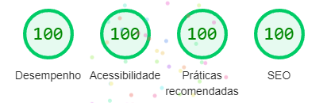

- Deploy [click here](https://pay-api-website-adrianoescarabote.vercel.app/)

# VIDEO-DESKTOP 

https://user-images.githubusercontent.com/101136987/221879205-883cda6d-a0d9-4d5c-898b-1dcaa82b3c0c.mp4

# Frontend Mentor - PayAPI multi-page website solution

This is a solution to the [PayAPI multi-page website challenge on Frontend Mentor](https://www.frontendmentor.io/challenges/payapi-multipage-website-FDLR1Y11e). Frontend Mentor challenges help you improve your coding skills by building realistic projects. 

## Table of contents

- [Overview](#overview)
  - [The challenge](#the-challenge)
- [My process](#my-process)
  - [Built with](#built-with)
  - [Continued development](#continued-development)
- [Author](#author)

## Overview

### The challenge

Users should be able to:

- View the optimal layout for each page depending on their device's screen size
- See hover states for all interactive elements throughout the site
- Receive an error message when the contact form is submitted if:
  - The `Name`, `Email Address` or `Message` fields are empty should show "This field can't be empty"
  - The `Email Address` is not formatted correctly should show "Please use a valid email address"

## My process

### Built with

- Semantic HTML5 markup
- CSS custom properties
- Flexbox
- CSS Grid
- Typescript
- [React](https://reactjs.org/) - JS library
- [Styled Components](https://styled-components.com/) - For styles

### Continued development

It is with great satisfaction that I express my gratitude for having completed this project. It was a very comprehensive and successful initiative, which involved the creation of a four-page website and represented an excellent test of my skills in building responsive layouts. The site in question is a complete marketing tool, which has personalized form validation. Importantly, I paid special attention to performance, accessibility, and SEO, which resulted in excellent reviews for Lighthouse (PC).

 

I have a strong desire to start larger projects, perhaps exploring different technologies.

## Author

- Linkedin - [AdrianoEscarabote](https://www.linkedin.com/in/adriano-escarabote-944b02233/)
- Frontend Mentor - [@AdrianoEscarabote](https://www.frontendmentor.io/profile/AdrianoEscarabote)
- Instagram - [@ogdrian](https://www.instagram.com/ogdrian/)
- Twitter - [@drianEscarabote](https://twitter.com/drianEscarabote)
